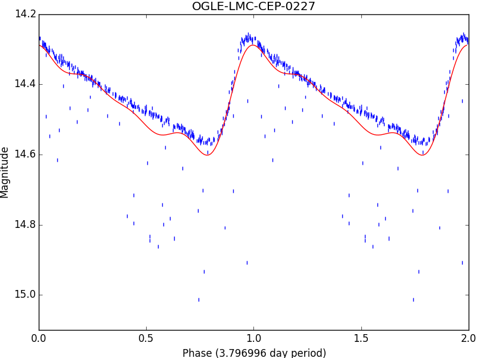
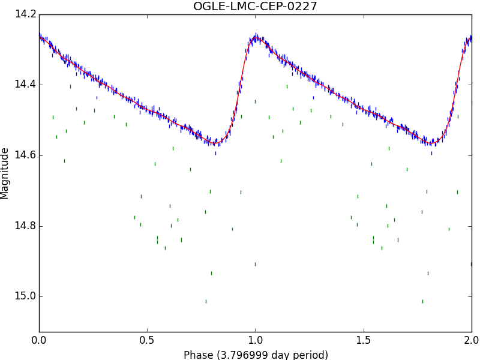

CLI Intermediate Guide
======================

.. note::

   This guide is out of date. Some of the CLI behavior has changed. Please bear
   with us while we update the guide.

.. note::

   This guide assumes you have already completed the
   `Beginner's Guide <cli-beginner.html>`_.

Now that you know how to fit and plot light curves, it is time you learn to
set some of the fitting parameters. First, create an empty directory, named
*plotypus-intermediate-tutorial*, and enter it::

   >> mkdir plotypus-intermediate-tutorial
   >> cd plotypus-intermediate-tutorial

To demonstrate the utility of different parameters, you will need a more
diverse set of light curves. We have provided a sample of OGLE-III stars
`here </plotypus/_static/samples/ogle-sample1.tar.gz>`_ [USSP]_.
Download and extract the files with::

   >> curl -O https://astroswego.github.io/plotypus/_static/samples/ogle-sample1.tar.gz
   >> tar -xvzf ogle-sample1.tar.gz

Now your directory should look like this::

    plotypus-intermediate-tutorial/
    ├── ogle-sample1
    │   ├── OGLE-BLG-RRLYR-02924.dat
    │   ├── OGLE-LMC-CEP-0674.dat
    │   └── OGLE-SMC-CEP-0668.dat
    └── ogle-sample1.tar.gz

Let us begin by finding the period of each star, and saving it to a file.
RR Lyrae have much shorter periods than Cepheids, so we are going to want to
search over a different range for that one. First, we are going to process the
two Cepheids::

   >> ls -d -1 ogle-sample1/*CEP* | plotypus --min-period 4.0 --max-period 9.0 > output.dat

Now we are going to append the RR Lyrae data to that table::

   >> plotypus -i ogle-sample1/OGLE-BLG-RRLYR-02924.dat --min-period 0.2 --max-period 1.0 | tail -n 1 >> output.dat

Take a look inside *output.dat*, it should be a table with 3 entries. We now
want to extract the names and periods, so that we can supply them to plotypus
on future runs. Run::

   >> tail -n +2 output.dat | cut -f 1,2 --output-delimiter="  " > periods.dat

Parallelism
-----------

Everything we have done up to here has ran sequentially, processing the first
star, *then* the second, *then* the third, etc. Wouldn't it be great if you
could make use of your multi-core processor (assuming you have one)? Well, you
can. Just provide the ``--star-processes N`` option, where ``N`` is the number
of processes you want to use. Try to keep ``N`` no larger than your computer's
total number of cores, because making ``N`` too large will just slow your
machine down. Let's try processing the 3 stars with 3 processes, using the
periods we just obtained::

   >> plotypus -i ogle-sample1/ -o plots/ --periods periods.dat --star-processes 3

Compare how long that took to using only one process as before::

   >> plotypus -i ogle-sample1/ -o plots/ --periods periods.dat

Now imagine the difference that would make when processing thousands of stars,
using a computer with many cores. We are going to stick with 3 for the rest of
this tutorial, since there are only 3 stars.

Selectors and Regressors
------------------------

Now we are going to introduce you to selectors and regressors. When fitting a
light curve, after the period is found, the observations are transformed from
temporal-space to phase-space. They are then transformed into Fourier-space,
which describes them as an :math:`n^\text{th}` degree
`Fourier series <https://en.wikipedia.org/wiki/Fourier_series>`_, by means of
`regression analysis <https://en.wikipedia.org/wiki/Regression_analysis>`_.
However, the choice of degree :math:`n` is non-trivial. A perfect fitting
function would have degree :math:`n = \infty`, but that is not possible for
real world data. We want to choose :math:`n` large enough to describe the data,
but keep it as small as possible. This is where selectors come in.

Selectors
^^^^^^^^^

A selector used in astronomy for many years now is Baart's criteria. See
:func:`plotypus.preprocessing.Fourier.baart_criteria` for details. In order
to tell plotypus to use this selector, include the ``--selector Baart`` option
when calling it. We are also going to tell plotypus to restrict its search
between degrees ``2`` and ``20``, which happens to be the default behaviour.
Let's try it for the 3 stars::

  >> plotypus -i ogle-sample1/ -o baart-plots/ --periods periods.dat --star-processes 3 --fourier-degree 2 20 --selector Baart > baart-output.dat

You can take a look through the output table, and plots if you'd like.

A selector used often in fields outside astronomy is
`grid search
<https://en.wikipedia.org/wiki/Hyperparameter_optimization#Grid_search>`_,
which does a much more exhaustive search of the parameters. In order to tell
plotypus to use this instead of Baart, include the ``--selector GridSearch``
option when calling it, although it is the option used by default::

  >> plotypus -i ogle-sample1/ -o gridsearch-plots/ --periods periods.dat --star-processes 3 --fourier-degree 2 20 --selector GridSearch > gridsearch-output.dat

The plots should look almost identical. Let's take a look at the Fourier
degrees they both selected, along with the :math:`R^2` of the fits::

  >> cut -f 1,7,9 baart-output.dat
  >> cut -f 1,7,9 gridsearch-output.dat

You should notice a difference here for sure.

Regressors
^^^^^^^^^^

Now that you have tried different methods of selecting the fit degree, it is
time to try different methods for creating the fit itself. A Fourier series
takes the form

.. math::
   m(t) = A_0 + \sum_{k=1}^n A_k \cos(k \omega t + \Phi_k)

Regression seeks to solve for coefficients :math:`A_0`, :math:`A_k`, and
:math:`\Phi_k`. Linear regression is the simplest form of regression, but since
this series is non-linear with respect to those coefficients, we use some
trigonometry to manipulate the series into the form

.. math::
   m(t) = A_0 + \sum_{k=1}^n [ a_k \sin(k \omega t) + b_k \cos(k \omega t) ]

Now we can use linear regression to solve for :math:`A_0`, :math:`a_k`, and
:math:`b_k`. Linear regression, in general, seeks to find the vector
:math:`\hat{b}` which minimizes the error in the equation

.. math::
   \mathbf{X} \hat{b} = \hat{y}

So we must first formulate the Fourier series into the design matrix
:math:`\mathbf{X}` (see :func:`plotypus.preprocessing.Fourier.design_matrix`)
and arrange the magnitudes into the vector :math:`\hat{y}`. This is all done
internally in plotypus, so you don't have to worry about it. What you *do* have
to think about, however, is *how* it solves for :math:`\hat{b}`. There are many
methods for solving such an equation, and plotypus currently comes with two.

The simplest and most straight forward method is
ordinary least squares, or
`OLS <https://en.wikipedia.org/wiki/Ordinary_least_squares>`_ for short.
This method finds the vector :math:`\hat{b}` which minimizes

.. math::
   ||\mathbf{X} \hat{b} - \hat{y}||_2,

where :math:`||x||_2` denotes the :math:`L_2`-norm. To tell plotypus to use
this method, simply provide the ``--regressor OLS`` option. We are going to
combine it with Baart's criteria as the selector, as that is a combination
commonly used in astronomy::

  >> plotypus -i ogle-sample1/ -o baart-ols-plots/ --periods periods.dat --star-processes 3 --fourier-degree 2 20 --selector Baart --regressor OLS > baart-ols-output.dat

Another regression method, used commonly in machine learning and statistics,
is the least absolute shrinkage and selection operator, or
`LASSO <https://en.wikipedia.org/wiki/Least_squares#Lasso_method>`_ for short.
In addition to seeking to minimize the error, LASSO seeks to minimize the sum
of the components of :math:`\hat{b}`, even driving some of them to zero.
Since two values are being minimized, they must each be assigned a certain
weight, and thus LASSO seeks to minimize

.. math::
   ||\mathbf{X} \hat{b} - \hat{y}||_2 + \lambda ||\hat{b}||_1

where :math:`||x||_1` denotes the :math:`L_1`-norm. :math:`\lambda` is yet
another value which must be chosen, and can be done so in many ways including
`cross validation
<https://en.wikipedia.org/wiki/Cross-validation_%28statistics%29>`_ and
`least-angle regression
<https://en.wikipedia.org/wiki/Least-angle_regression>`_, the latter of which
is used in plotypus. To tell plotypus to use this method, provide the option
``--regressor Lasso``. We are going to combine this with grid search::
  
  >> plotypus -i ogle-sample1/ -o gridsearch-lasso-plots/ --periods periods.dat --star-processes 3 --fourier-degree 2 20 --selector GridSearch --regressor Lasso > gridsearch-lasso-output.dat

Outlier Detection
-----------------

The stars we have processed so far have all had very well behaved data, as far
as variable stars go. Now consider a less well behaved star, with lots of
outlier points. We don't want those outliers harming our results. One star of
particular interest from the OGLE-III catalog is
`OGLE-LMC-CEP-0227 </plotypus/_static/samples/OGLE-LMC-CEP-0227.dat>`_ [USSP]_,
a Cepheid which is part of an
`eclipsing binary system
<https://en.wikipedia.org/wiki/Binary_star#Eclipsing_binaries>`_.
Download the photometry::

  >> curl -O https://astroswego.github.io/plotypus/_static/samples/OGLE-LMC-CEP-0227.dat

Now try fitting it with both methods we've used, allowing them both to find
the period (we'll constrain it between 3 and 4 days to save time). For the
sake of demonstration, we are going to add the parameter ``--sigma 9999``,
which will ensure that nothing is marked as an outlier::

  >> plotypus -i OGLE-LMC-CEP-0227.dat -o baart-ols-plots/ --min-period 3.0 --max-period 4.0 --selector Baart --regressor OLS --sigma 9999 > 0227-baart-ols.dat
  >> plotypus -i OGLE-LMC-CEP-0227.dat -o gridsearch-lasso-plots/ --min-period 3.0 --max-period 4.0 --selector GridSearch --regressor Lasso --sigma 9999 > 0227-gridsearch-lasso.dat

Now take a look at the plots generated in the *baart-ols-plots* and
*gridsearch-lasso-plots* directories, both named *OGLE-LMC-CEP-0227.png*. They
should look something like this:

Those outliers caused by its companion star are really problematic. Let's try
that again, but this time with a lower sigma. The default is 20, so we'll go
with that::

  >> plotypus -i OGLE-LMC-CEP-0227.dat -o baart-ols-plots/ --min-period 3.0 --max-period 4.0 --selector Baart --regressor OLS --sigma 20 > 0227-baart-ols.dat
  >> plotypus -i OGLE-LMC-CEP-0227.dat -o gridsearch-lasso-plots/ --min-period 3.0 --max-period 4.0 --selector GridSearch --regressor Lasso --sigma 20 > 0227-gridsearch-lasso.dat

This time it should come out much better. Notice the outliers have been colored
green instead of blue:

In addition to providing a cutoff *sigma*, you can also provide the method by
which sigma-clipping is performed. The default method is
`median absolute deviation
<https://en.wikipedia.org/wiki/Median_absolute_deviation>`_, which can be
given explicitly with the ``--sigma-clipping mad`` option. The alternative is
to use
`standard deviation <https://en.wikipedia.org/wiki/Standard_deviation>`_
with the ``--sigma-clipping std`` option. You will want to use a much smaller
*sigma* value for this, compared to before. Let's give it a try::

  >> plotypus -i OGLE-LMC-CEP-0227.dat -o gridsearch-lasso-plots/ --min-period 3.0 --max-period 4.0 --selector GridSearch --regressor Lasso --sigma 2 --sigma-clipping std > 0227-gridsearch-lasso.dat

It's not terrible, but notice there are many outliers which have not been
marked as such:

.. image:: images/OGLE-LMC-CEP-0227-std.png

That concludes this guide. We recommend you download the OGLE-III catalog
yourself and try running plotypus on more of the data there.

**Citations**

.. [USSP] Udalski, A. ; Szymanski, M. K. ; Soszynski, I. ; Poleski, R., 2008,
          "The Optical Gravitational Lensing Experiment.
          Final Reductions of the OGLE-III Data",
          Acta Astronomica, vol. 58, pp. 69-87
